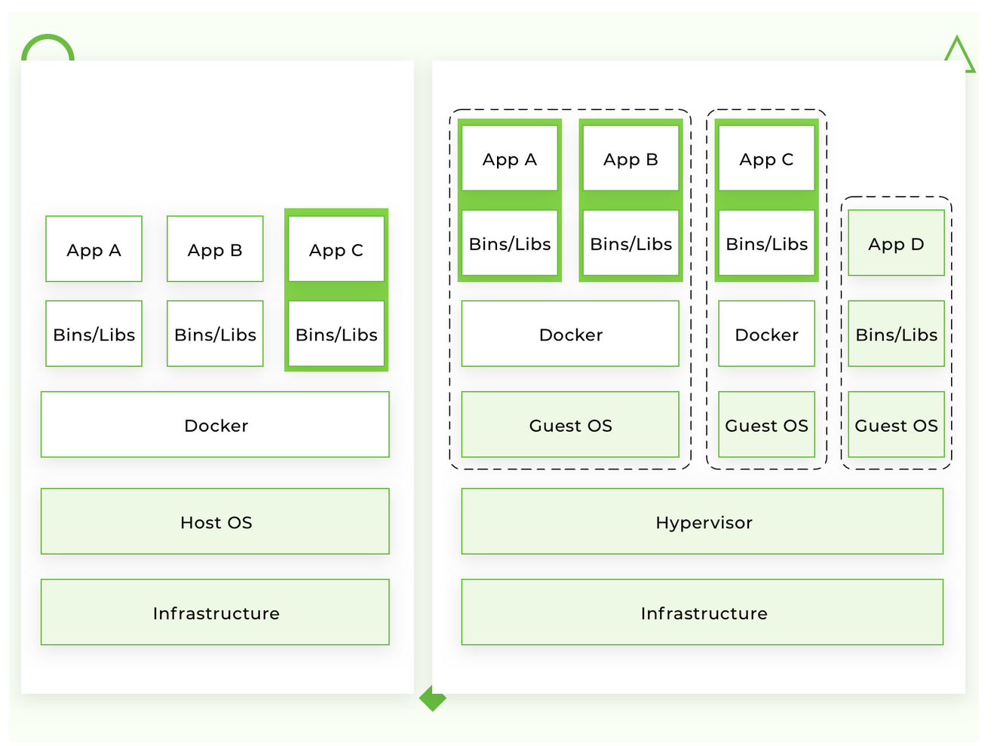

REST API: Your Guide to Getting Started Quickly
===============================================
> Written by Jack Kasbeer [03.03.19 : 22:55]
[Reference documentation](https://stackify.com/rest-api-tutorial/)

Intro
-----
* REST is often refered to as a protocol, but it is an **architectural style**.  It defines how applications communicate over HTTP (..the protocol).
* Best used with loosely-coupled applications to transfer information quickly and efficiently.
* REST doesn't define data formats, it usually exchanges JSON and XML documents between a client & server.

*This document/walk-through should leave you with knowing how to use Docker on your local machine.* Along with **Python**, we will run **Nginx** and **Redis** containers.

> ***WARNING: examples assume familiarity with the basic concepts of those technologies.***

Table of Contents
-----------------
* What is Docker?
* How does it differ from virtualization?
* Why do we need Docker?
* Supported platforms
* Installation
* Terminology
* Examples (3)
* Best practices for creating images
* Alpine images
* Example: Connection between containers
* Docker way
* Conclusion

What is Docker?
---------------
**Requirement to move forward:** you'll need a system with [Docker](https://www.docker.com/get-started)

> Docker is an open-source tool that automates the deployment of an application inside a software container.  It's most obvious abstraction is cargo shipping containers.

Building and developing new applications is faster with containers. Docker containers wrap up software and its dependencies into a standardized unit for software development that includes everything it needs to run: code, runtime, system tools and libraries.

Docker containers (Windows or Linux) are backed by Docker tools and APIs and help you build better software:
* Onboard faster stop wasting hours setting up environments, spin up new instances and **make copies of production code to run locally.**
* Enable polyglot development and use any language, stack or tools without worry of application conflicts.
* Eliminate the "works on my machine" problem by packaging the application, configs and dependencies into an isolated container.
* **Alleviate concern over application security.**

How does this differ from virtualization?
-----------------------------------------
**Problems:**
* *Main problem* with VM is that an "extra OS" on top of the host operating system adds gigabytes of space to the project.  
* Hosting more VMs on your server ==> more space consumed, and at the moment, most cloud-based server providers will charge you for that extra space.
* Slow boot

Docker eliminates all of the above by simply **sharing the OS kernel across all the containers running as separate processes of the host OS.**

*Show above:* Left design - visualizing the enormous design advantage of using Docker instead of VMs, as it eliminates the need for a Hypervisor and accompanying Guest OSs associated with each VM; right design - what it would end up looking like if Docker was implemented on each of the VMs instead of the main server.

There are advantages to both designs, but if latency is going to be a concern, then VMs should be strayed away from.

Why do we need Docker?
----------------------
The short list of benefits includes:
* Faster development process
* Handy application encapsulation
* The same behaviour on local machine / dev / staging /production servers
* Easy and clear monitoring
* Easy to scale

### Faster development process
No need to install 3rd-party apps like PostgreSQL, Redis, or Elasticsearch on the system - you can run it in containers.

Docker also gives you the ability to run different versions of the same application simultaneously.

### Handy application encapsulation
You can deliver your application in one piece.  Docker gives you a unified image format to distribute your applications across different host systems and cloud services.  You can deliver your application in one piece with all the required dependencies ready to run **(all in an image).**

### Same behaviour on local machine / dev /staging / production servers
With right approach to building Docker images, your application will use the same base image with the same OS version and the required dependencies.

### Easy and clear monitoring
**Out of the box**, you have a unified way to read log files from all running containers. You don’t need to remember all the specific paths where your app and its dependencies store log files and write custom hooks to handle this.

You can also integrate an [external logging driver](https://docs.docker.com/config/containers/logging/configure/#supported-logging-drivers) and **monitor your app log files in one place.**

### Easy to scale
By design, Docker forces you to follow its core principles, such as configuration over environment variables, communication over TCP/UDP ports, etc. If you've done it right, it will be ready to scale, and not only in Docker.

Supported Platforms
-------------------
Native for Docker is Linux (being based on features provided by the Linux kernel). However, you can still run on macOS and Windows. Only difference being is on a mac or windows, Dock is encapsulated into a tiny VM.

Installation
------------
See installation instructions for Docker [here](https://docs.docker.com/install/).

Terminology
-----------
* **Container** - *a running instance that encapsulates required software.*
    Always created from images.
    Can expose ports and volumes to interact with other containers or/and the outer world.
    Can be easily killed / removed and re-created again in a very short time.
    Containers don’t keep state.
* **Image** - *the basic element for every container.*
    When you create an image, every step is cached and can be reused (Copy On Write model (1)).
    Depending on the image, it can take some time to build. Containers, on the other hand, can be started from images right away.
* **Port** - *a TCP/UDP port in its original meaning.*
    To keep things simple, let’s assume that ports can be exposed to the outer world (accessible from the host OS) or connected to other containers – i.e., accessible only from those containers and invisible to the outer world.
* **Volume** - *can be described as a shared folder.*
    Initialized when a container is created.
    Designed to persist data, independent of the container’s lifecycle.
* **Registry** - *the server that stores Docker images.*
    It can be compared to Github – you can pull an image from the registry to deploy it locally, and push locally built images to the registry.
* **Docker Hub** - *a registry with web interface provided by Docker Inc.*
    It stores a lot of Docker images with different software. 
    It is a source of the “official” Docker images made by the Docker team or in cooperation with the original software manufacturer (it doesn’t necessary mean that these “original” images are from official software manufacturers). Official images list their potential vulnerabilities. This information is available to any logged-in user. 
    There are both free and paid accounts available. 
    You can have one private image per account and an infinite amount of public images for free. 
* **Docker Store** - *a service very similar to Docker Hub.*
    It’s a marketplace with ratings, reviews, etc. 
    My personal opinion is that it’s marketing stuff. 
    I’m totally happy with Docker Hub.

> **(1)** Copy-on-write, sometimes referred to as *implicit sharing* or *shadowing*, is a resource-management technique used in CS to efficiently implement a "duplicate" or "copy" operation on modifiable resources.  A perfect example of where this may be found in a commonly overlooked implementation is *cache coherence.* But that's way beyond what we're talmbout ;)

